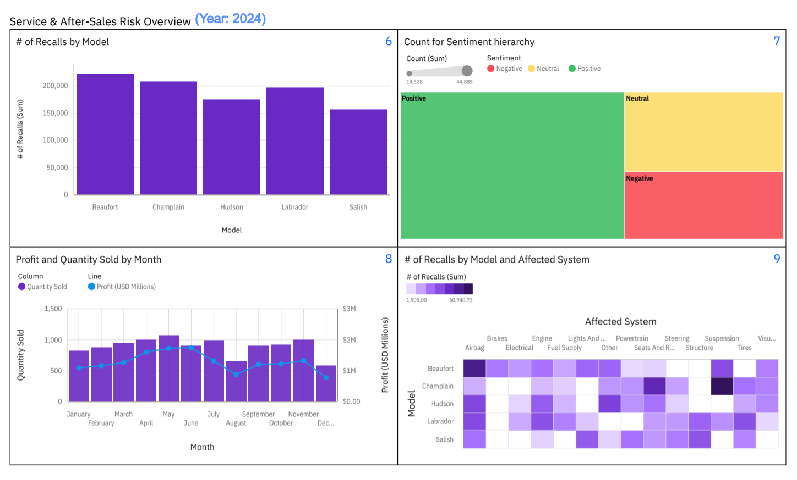

# Dealer Performance & After-Sales Risk Intelligence Dashboard

## 📌 Project Overview

This Business Intelligence case study analyzes dealer performance, seasonal sales volatility, and recall exposure using IBM Cognos Analytics.

The objective is to evaluate revenue drivers, identify systemic demand patterns, and assess operational risk distribution across dealers and vehicle models.

---

## 📸 Dashboard Preview

### Sales Dashboard

### Service Dashboard

---

## 🎯 Business Objectives

- Evaluate dealer-level profit contribution
- Identify seasonal volatility in sales performance
- Assess recall exposure by vehicle model
- Examine short-term correlation between recall activity and demand
- Determine whether operational risk is concentrated in primary revenue drivers

---

## 📊 Key Findings

### Seasonal Demand Pattern
- Strong profit growth observed in the first half of 2024.
- Systemic contraction occurred in August and December.
- Similar pattern observed across multiple years, indicating seasonality.

### Volume-Driven Profit Volatility
- Monthly profit closely mirrors quantity sold.
- Demand contraction — not margin compression — is the primary driver of volatility.
- Sales slowdown affected all major dealers and models.

### Recall Impact Assessment
- Recall spikes did not directly precede profit declines.
- Sales momentum continued despite recall events earlier in the year.
- No strong short-term recall-to-demand correlation observed.

### Revenue Risk Distribution
- Hudson is the top-selling model.
- Beaufort has the highest recall count.
- Recall exposure is not concentrated in the primary revenue-generating model.
- Champlain shows relatively high recall activity despite low sales volume.

---

## 🛠 Tools & Technologies

- IBM Cognos Analytics
- Data aggregation & KPI modeling
- Business diagnostic analysis

---

## ⚠ Limitations

- External macroeconomic variables not included
- Recall dataset does not extend fully into latest sales year
- Margin analysis limited to aggregated profit
- Sentiment not weighted by impact severity

---

## 📚 Data Source & Attribution

Developed as part of an IBM Cognos Analytics course delivered via Coursera.  
Dataset is a modified lab subset provided within the course environment.  
All original data rights belong to IBM.

---

## 👤 Author

Muhammad Rafi Akbar  
Business Intelligence & Data Analytics Enthusiast
