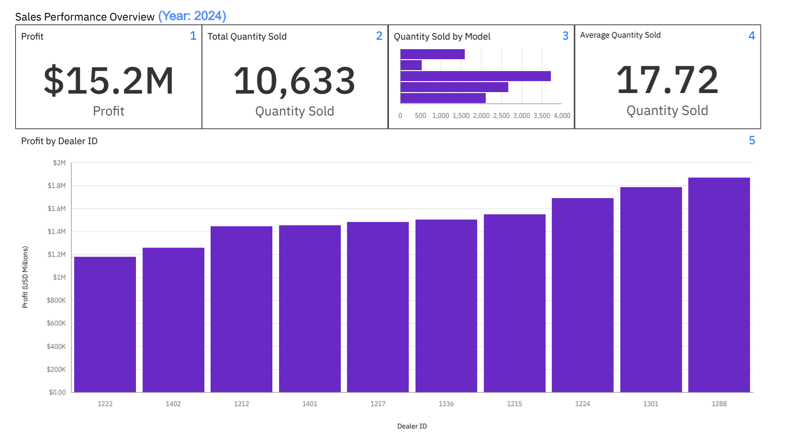

# Dealer Performance & After-Sales Risk Intelligence Dashboard

## 📌 Project Overview

This Business Intelligence case study analyzes dealer performance, seasonal sales volatility, and recall exposure using IBM Cognos Analytics.

The objective is to evaluate revenue drivers, identify systemic demand patterns, and assess operational risk distribution across dealers and vehicle models.

## 📸 Dashboard Preview
### Sales Dashboard

---

## 🎯 Business Objectives

- Evaluate dealer-level profit contribution
- Identify seasonal volatility in sales performance
- Assess recall exposure by vehicle model
- Examine short-term correlation between recall activity and demand
- Determine whether operational risk is concentrated in primary revenue drivers

---

## 📊 Key Findings

### 1️⃣ Seasonal Demand Pattern
- Strong profit growth observed in the first half of 2024.
- Systemic contraction occurred in August and December.
- Similar pattern observed across multiple years, indicating seasonality.

### 2️⃣ Volume-Driven Profit Volatility
- Monthly profit closely mirrors quantity sold.
- Demand contraction — not margin compression — is the primary driver of volatility.
- Sales slowdown affected all major dealers and models.

### 3️⃣ Recall Activity Does Not Show Immediate Demand Impact
- Recall spikes did not directly precede profit declines.
- Sales momentum continued despite recall events earlier in the year.
- No strong short-term recall-to-demand correlation observed.

### 4️⃣ Revenue Driver Risk Assessment
- Hudson is the top-selling model.
- Beaufort has the highest recall count.
- Recall exposure is not concentrated in the primary revenue-generating model.

### 5️⃣ Model-Level Risk Distribution
- Champlain shows relatively high recall activity despite low sales volume.
- Indicates potential model-specific quality concerns rather than systemic revenue threat.

---

## 📈 Dashboards Included

### Sales Dashboard
- Total Profit (USD)
- Total Quantity Sold
- Average Quantity Sold
- Profit by Dealer (Ascending)
- Quantity Sold by Model

### Service Dashboard
- Recall Count by Model
- Customer Sentiment Distribution
- Monthly Profit vs Quantity Trend
- Recall by Model and Affected System (Heatmap)

---

## 🔍 Extended Analysis (Beyond Assignment Scope)

Additional exploratory analysis was conducted using 2024 data:

- Monthly profit trend analysis
- Dealer-level contribution breakdown
- Volume vs profit volatility validation
- Model-level recall vs sales comparison
- Seasonal contraction pattern identification

---

## 🛠 Tools & Technologies

- IBM Cognos Analytics
- Data aggregation & KPI modeling
- Risk interpretation & business diagnostic analysis

---

## ⚠ Limitations

- External macroeconomic variables not included
- Recall dataset does not extend fully into latest sales year
- Margin analysis limited to aggregated profit
- Sentiment not weighted by impact severity

---

## 📚 Data Source & Attribution

This project was developed as part of an IBM Cognos Analytics course delivered via Coursera.

The dataset used is a modified subset provided within the course lab environment.  
All original data rights belong to IBM.

This repository contains independently created analysis outputs and visualizations for portfolio purposes.

---

## 👤 Author

Muhammad Rafi Akbar  
Aspiring Business Intelligence & Data Professional
